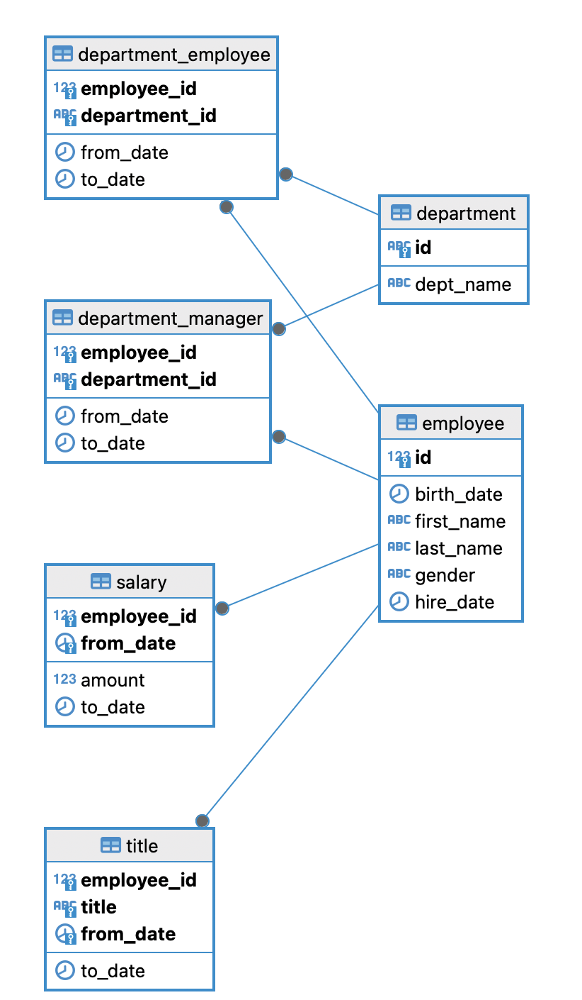

## Postgress Container for practicing SQL on local

## Setup Instructions
###  Clone the Repository
Clone this repository or navigate to your project directory where you have the sql-docker folder.

git clone git@github.com:ravindrasingh22/postgress-sql-interview-practice-questions.git

cd postgress-sql-interview-practice-questions/sql-docker

Go To directory

## Remove any existing containers and volumes to ensure a fresh setup
docker-compose down -v

## Build and start the containers in detached mode
docker-compose up -d

## Connect the dbeaver with credentials

POSTGRES_USER: employee_u
POSTGRES_PASSWORD: employee_p
POSTGRES_DB: employee_db
Host : localhost
Port : 5433

# ** happy practising ** #

# ER diagram

Credits - For database dump -

https://github.com/neondatabase/postgres-sample-dbs?tab=readme-ov-file#employees-database
